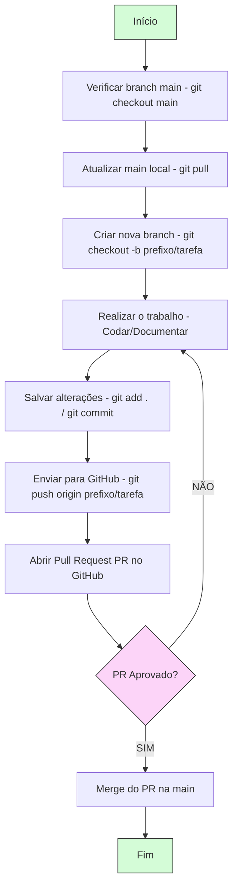

# 💱 Ionic Currency Converter


Um aplicativo móvel desenvolvido em Ionic para conversão de moedas em tempo real, consumindo APIs REST externas para obter taxas de câmbio atualizadas.


## 📱 Descrição do Projeto

O **Ionic Currency Converter** é um aplicativo móvel para Android que permite aos usuários:

- 💵 Consultar taxas de câmbio em tempo real
- 🔄 Converter valores entre diferentes moedas globais
- 📊 Visualizar histórico de conversões
- 📈 Acompanhar variações das cotações
- 🌐 Funcionar offline com dados armazenados localmente

### Principais Funcionalidades

- **Integração com API de Câmbio:** Consumo de APIs REST (ExchangeRate-API ou CurrencyConverterAPI)
- **Interface Responsiva:** Design intuitivo e adaptável para diferentes tamanhos de tela
- **Histórico de Conversões:** Armazenamento local das conversões recentes
- **Suporte Multilíngue:** Ampla variedade de moedas internacionais
- **Modo Offline:** Utilização de taxas armazenadas localmente
- **Conversão Inversa:** Inversão rápida entre moedas de origem e destino
- **Gráficos de Cotação:** Visualização de variações históricas das taxas


## 🚀 Tecnologias Utilizadas

- **Framework:** Ionic 7.0+
- **Linguagem:** TypeScript
- **APIs:** ExchangeRate-API / CurrencyConverterAPI
- **Armazenamento:** Local Storage / SQLite
- **Controle de Versão:** Git/GitHub

## 📋 Pré-requisitos

Antes de começar, você precisará ter instalado:

- **Node.js** (versão LTS recomendada)
- **npm** (gerenciador de pacotes do Node.js)
- **Ionic CLI:** `npm install -g @ionic/cli`
- **Git:** Para controle de versão
- **Android Studio** (para testes em emulador Android - opcional)

> **📘 Documentação Completa:** Para informações detalhadas sobre todas as ferramentas, bibliotecas, frameworks e comandos de instalação/configuração, consulte o **[Tutorial de Ferramentas e Stack](ionicnewsdocs/Tutorial-Ferramentas-Stack.pdf)**.

## 📥 Como Baixar o Repositório

```bash
# Clone o repositório
git clone https://github.com/seu-usuario/IonicCurrencyConverter.git

# Entre na pasta do projeto
cd IonicCurrencyConverter

# Acesse a pasta do aplicativo Ionic
cd ionicnewsapp

# Instale as dependências
npm install

# Execute o aplicativo no navegador
ionic serve
```

## 🔧 Fluxo de Trabalho no Repositório

O projeto utiliza um fluxo de trabalho baseado em branches para organizar o desenvolvimento:


main (produção)
  ↑
  └── feature/conversao-moedas
  └── feature/historico
  └── dev/nome-desenvolvedor
```


### Como Contribuir

1. Crie um branch a partir do `main`
2. Desenvolva sua funcionalidade
3. Faça commits regulares
4. Envie o branch para o remoto
5. Abra um Pull Request
6. Aguarde revisão e aprovação
7. Merge para o `main`

> **📗 Guia Completo:** Para instruções detalhadas sobre todos os comandos Git e o fluxo de trabalho passo a passo, consulte o **[Guia de Comandos Git](ionicnewsdocs/UseCase/Guia-comandos-git.pdf)**.

## 🤝 Contribuindo

Contribuições são bem-vindas! Para contribuir:

1. Leia o arquivo **[CONTRIBUTING.md](CONTRIBUTING.md)** para entender nosso processo de desenvolvimento
2. Consulte os guias de referência:
   - **[Guia de Comandos Git](ionicnewsdocs/Guia-comandos-git.pdf)** - Tutorial completo de Git
   - **[Tutorial de Ferramentas e Stack](ionicnewsdocs/Tutorial-Ferramentas-Stack.pdf)** - Configuração do ambiente
3. Crie um branch para sua contribuição
4. Faça suas alterações seguindo as boas práticas
5. Envie um Pull Request

## 📁 Estrutura do Projeto

```
IonicCurrencyConverter/
├── ionicnewsapi/          # Backend API (opcional)
├── ionicnewsapp/          # Aplicativo Ionic principal
│   ├── src/
│   │   ├── app/
│   │   ├── assets/
│   │   └── environments/
│   └── package.json
├── ionicnewsdocs/         # Documentação do projeto
│   ├── Models/
│   │   ├── classes/       # Diagramas UML
│   │   ├── database/      # Diagramas ER
│   │   ├── mindmap/       # Mapas mentais
│   │   └── Mockup/        # Protótipos de interface
│   ├── Sql/               # Scripts de banco de dados
│   └── UseCase/           # Casos de uso e guias
│       ├── Guia-comandos-git.pdf
│       └── Tutorial-Ferramentas-Stack.pdf
├── .gitignore
├── CONTRIBUTING.md        # Guia de contribuição
├── LICENSE                # Licença Creative Commons
├── README.md              # Este arquivo
└── TODO.md                # Tarefas pendentes
```

## 👥 Autores

### Equipe de Desenvolvimento

- **Scrum Master:** [Nickolas Eduardo Gonçalves de Oliveira] - Gestão do projeto e cronogramas
- **Gerente de Configuração:** [Davi Ramos Ferreira] - Controle de versão e documentação
- **Documentadores:** [Gabriel Cauã Ferreira de Brito] - Casos de uso e diagramas
- **Desenvolvedores:** [João Mariano], [Davi Ramos Ferreira] - Implementação do código

## 📄 Licença

Este projeto está licenciado sob a [Creative Commons Attribution-ShareAlike 4.0 International License](LICENSE).

---

**Desenvolvido com 💙 pela equipe do Ionic Currency Converter**
